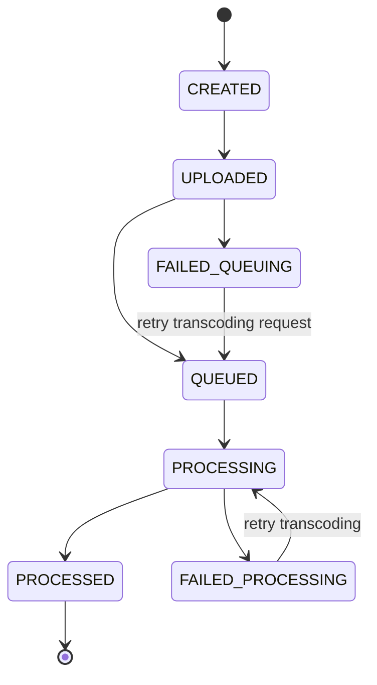

# Video Post

A `Video Post` is a unit used to manage videos in the form of posts, allowing users to share video content. When viewing shared videos, they need to be viewed in a compressed format to save network bandwidth, which requires a transcoding process. Therefore, even if the purpose is not to share the video but rather to transcode it, a `Video Post` should be used.

## How to Use Video Post

The steps to use a `Video Post` are as follows:

1. Create a `Video Post`
2. Additional settings for the `Video Post`
3. Upload the original video file to the `Video Post`
4. Automatic transcoding of the uploaded original video file
5. Viewing the transcoded video output

Details for each step are as follows:

### Video Post Properties and Creation

`Video Post` has the following properties:

- **Required Properties at Creation**
  - `appUserId`: The creator and owner of the `Video Post`. When using the server API, this must be specified; when using the client API, the member making the request becomes the creator, so it doesn’t need to be explicitly specified.
- **Read-Only Properties**
  - `videoPostState`: The state of the `Video Post` based on its lifecycle.
- **Read/Write Properties**
  - `title`: Title
  - `description`: Description
  - `accessLevel`: Access restriction level, currently only supports `PUBLIC` (open to everyone).
  - `videoTranscodingProfileId`: The ID of the transcoding profile to use for the original video file. If not set, the default value is used, and this cannot be changed once transcoding starts.
  - `thumbnailTranscodingProfileId`: The ID of the transcoding profile to use for extracting the thumbnail. If not set, no thumbnail is extracted, and this cannot be changed once transcoding starts.
  - `previewTranscodingProfileId`: The ID of the transcoding profile to use for extracting the preview. If not set, no preview is extracted, and this cannot be changed once transcoding starts.
  - `customData`: A property for storing arbitrary information in a key-value pair object format.

By setting these properties, a `Video Post` with a status of `CREATED` is generated.

### Additional Settings for Video Post

After creating a `Video Post`, most attributes can be modified except for those related to the transcoding profiles. Additionally, thumbnails and previews can be extracted using transcoding profiles, or files can be directly uploaded for these settings.

### Uploading the Original Video File to Video Post

When uploading an original video to a `Video Post`, you first need to request an upload URL through the API. You can specify the number of parts the file will be divided into for the upload. Depending on the specified number of parts, the API will respond with the upload URLs. After uploading each file part to its respective URL, call the upload completion API. The `Video Post` status changes to `UPLOADED`, and once **FlipFlop Cloud** combines the uploaded parts into a single file, a transcoding job is internally requested, changing the status to `QUEUED`.

### Transcoding Process

When the transcoder starts processing, the `Video Post` status changes to `PROCESSING`, and once the process is completed, the status changes to `PROCESSED`. When querying a `Video Post` with completed transcoding, the `file` attribute contains information about the original file, transcoded output, thumbnail, and preview files.

## Video Post Status

A `Video Post` can have the following statuses:

- **Normal Statuses**
  - `CREATED` - Created
  - `UPLOADED` - Uploaded
  - `QUEUED` - Transcoding request for the original video file completed (original viewable)
  - `PROCESSING` - Transcoding in progress (original viewable)
  - `PROCESSED` - Transcoding complete (both original and transcoded versions viewable)
- **Error Statuses**
  - `FAILED_UPLOAD` - Upload failed (not viewable)
  - `FAILED_QUEUING` - Transcoding request failed (original viewable)
  - `FAILED_PROCESSING` - Transcoding failed (original viewable)

The flow of statuses is as follows:

