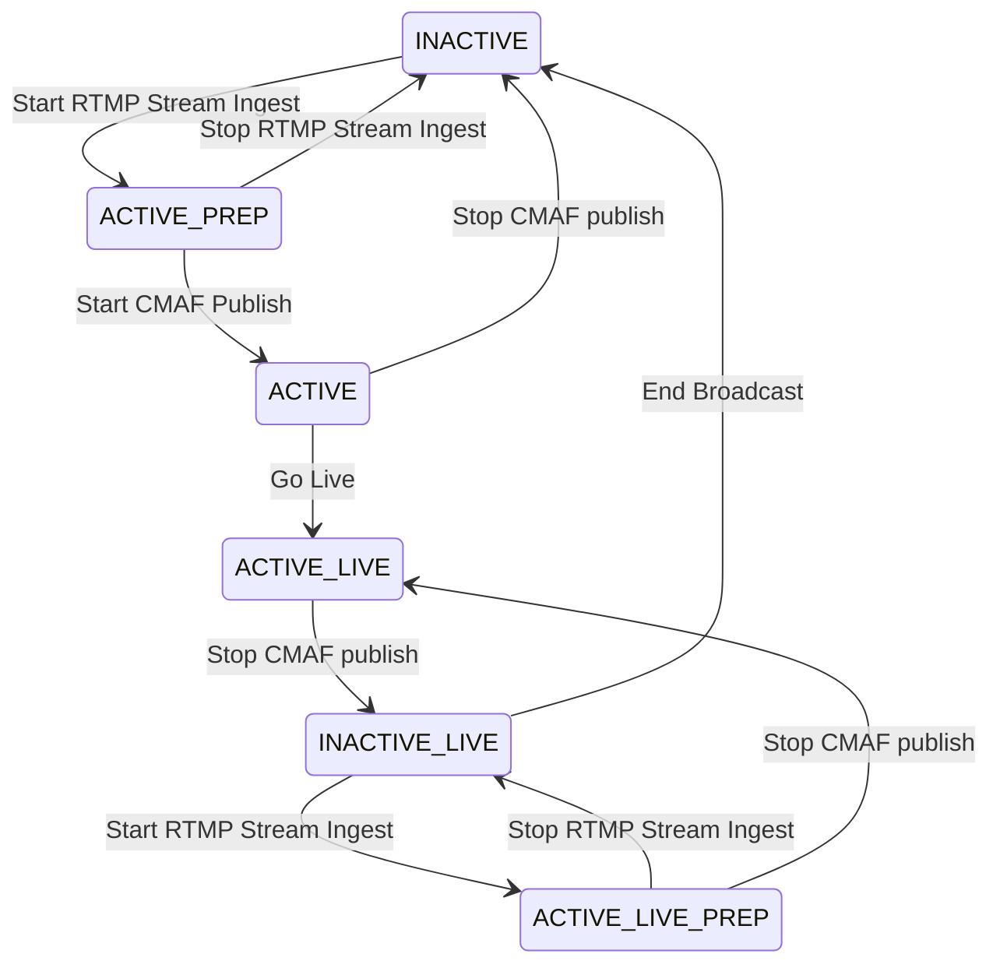
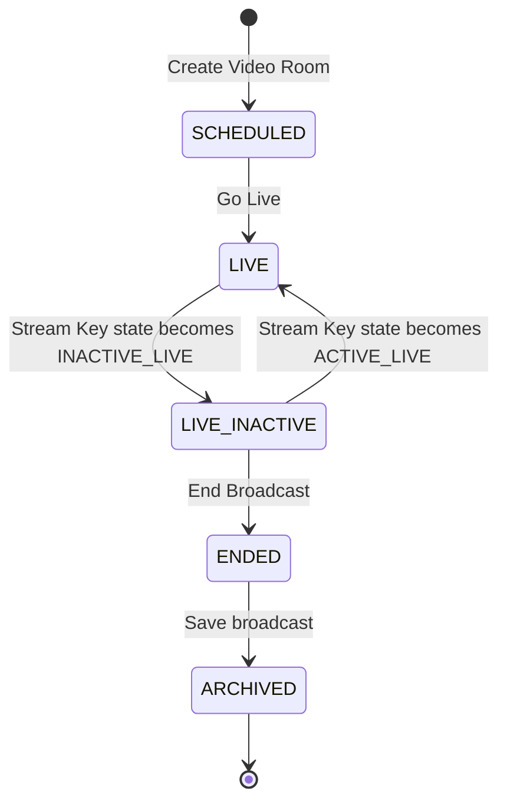

# Video Room

A `Video Room` allows people to communicate and interact in real-time using video as a medium. Currently, FlipFlop Cloud supports the following two types of `Video Rooms`, with more types planned for the future:

- `BROADCAST_RTMP` - A type that allows live streaming using the RTMP protocol, making it viewable via RTMP, HTTP-FLV, HLS, and MPEG-DASH.
- `VIDEO_CONFERENCE` - A type that enables video conferencing using WebRTC.

Details for each type are as follows:

## BROADCAST_RTMP Video Room

This type of `Video Room` allows a broadcaster to stream video using the RTMP protocol so that others can view the stream in real-time via RTMP, HTTP-FLV (FLV over HTTP), and CMAF (HLS and MPEG-DASH). To conduct a live broadcast using a `BROADCAST_RTMP` type `Video Room`, follow these steps:

1. Create a `Video Room` of the `BROADCAST_RTMP` type, specifying a registered member as the creator.
   - Currently, live broadcasts are only available through RTMP streaming. The stream is converted to formats suitable for multiple viewers, including CMAF (HLS and MPEG-DASH) and RTMP.
2. Use the stream key of the member who created the `Video Room` to stream RTMP to FlipFlop Cloud.
   - Each member has a unique stream key, which is used in the URL when they broadcast a video stream. The stream key also determines how the RTMP stream is converted and output.
3. Start the broadcast from the `Video Room` once the RTMP stream is ready for viewing.
   - When the RTMP stream has been converted into a viewable format, the `Video Room` can begin broadcasting, and the URL information for viewing the stream will be updated. This allows other members (or viewers) to watch the broadcast.
4. Share the `Video Room` URL with viewers so they can watch the broadcast.
5. End the broadcast from the `Video Room`.

Detailed explanations for each step are provided below.

### 1. Creating a Video Room

When creating a video room, you can specify the following properties:

- **Required**
  - `type`: `BROADCAST_RTMP`
  - `appUserId`: The creator and owner of the `Video Room`. This must be specified when using the server API; when using the client API, the member making the request becomes the creator automatically.
  - `scheduledAt`: The scheduled start time of the broadcast as an ISO 8601 formatted string. This is for display purposes and has no functional impact.
- **Optional**
  - `title`: Title of the live broadcast in the `Video Room`.
  - `description`: Description of the broadcast in the `Video Room`.
  - `accessLevel`: Currently, only `PUBLIC` is supported, meaning anyone with the broadcast viewing URL can watch.

### 2. Streaming RTMP to FlipFlop Cloud Using the Creator's Stream Key

The `stream key` identifies the member broadcasting the stream when the RTMP stream enters FlipFlop Cloud. It also determines the output formats (RTMP, HTTP-FLV, CMAF) and the `Transcoding Profile` used in the process. The stream key is assigned to each member and can be shared with them via the server API or retrieved by the member through the client API.

#### Setting the Broadcast Output Mode

The streamed RTMP can be viewed in the following formats:

- `RTMP`: View via RTMP protocol (low latency, under 2 seconds, but inaccessible if the RTMP port is blocked).
- `HTTP-FLV`: View via HTTP protocol with FLV conversion (low latency, under 2 seconds, and more accessible than RTMP).
- `HLS`: View in HLS format (stable and economical, but with a slightly longer latency of around 8 seconds).
- `MPEG-DASH`: View in MPEG-DASH format (stable and economical, similar latency to HLS).

There are three broadcast output modes:

- `RTMP` - Outputs in `RTMP` and `HTTP-FLV` formats.
- `CMAF` - Outputs in `HLS` and `MPEG-DASH` formats.
- `RTMP_CMAF` - Outputs in all four formats: `RTMP`, `HTTP-FLV`, `CMAF`, and `MPEG-DASH`.

The output mode can be configured in three ways, with the following priority:

1. Set via the stream URL when streaming RTMP (e.g., adding a query parameter: `?mode=RTMP`).
2. Set in the `stream key`.
3. Set in the `App`.

#### Streaming RTMP

To stream RTMP, use the following properties from the stream key response:

- `ingestURL`: The URL to set as the streaming endpoint in the RTMP streaming software or FlipFlop Cloud SDK.
- `streamKey`: The actual stream key string to use for streaming.

Combine these as follows:

```shell
// The actual streaming URL
${ingestURL}/${streamKey}

// With output mode specified
${ingestURL}/${streamKey}?mode=${mode}
```

#### Stream Key and Video Room States

The `streamKey` has a `streamKeyState` attribute, and the `Video Room` has a `videoRoomState` attribute. These indicate the states of each entity, changing based on the status of the RTMP stream and the live status of the `Video Room`.

- **Stream Key States**
  - `INACTIVE` - No stream is being broadcast using the stream key.
  - `ACTIVE_PREP` - Stream detected successfully using the stream key.
  - `ACTIVE` - Stream converted to a viewable format.
  - `ACTIVE_LIVE` - Stream is live and viewable through the `Video Room`.
  - `INACTIVE_LIVE` - Stream stopped, but the broadcast can be resumed.
  - `ACTIVE_LIVE_PREP` - Resumption of stream detected successfully.



- **Video Room States**
  - `SCHEDULED` - `Video Room` created.
  - `LIVE` - Currently broadcasting.
  - `LIVE_INACTIVE` - Broadcast paused.
  - `ENDED` - Broadcast ended.
  - `ARCHIVED` - VOD version created.



### 3. Starting the Broadcast

Once the member's `streamKey` reaches the `ACTIVE` state after streaming RTMP, the member can start the broadcast in the created `Video Room`. Only one broadcast can be active per member at a time. Once the broadcast starts, the `streamKey` status changes to `ACTIVE_LIVE`, and the `Video Room` URL is updated with the viewable stream URLs.

### 4. Sharing the Video Room URL

To allow viewers to watch the broadcast, you can retrieve the viewable URL using the FlipFlop Cloud API or directly share the URL information with viewers. Currently, since `PUBLIC` is the only supported access level, anyone with the URL can watch the broadcast.

### 5. Ending the Broadcast

When the broadcast is stopped, it cannot be restarted. The recommended method is to stop the stream and end the broadcast when the `streamKey` state becomes `INACTIVE_LIVE`. Alternatively, you can forcefully end the broadcast, which changes the `streamKey` for security reasons.

After ending, FlipFlop Cloud automatically converts the broadcast into a VOD format by creating a `Video Post`. The VOD uses a `Transcoding Profile` suitable for on-demand viewing.

To check the VOD information, query the `videoPostId` attribute in the `Video Room`. If the state is `ARCHIVING`, transcoding is in progress. When it changes to `ARCHIVED`, the VOD is ready for viewing.

## VIDEO_CONFERENCE Video Room

This type of `Video Room` is currently available exclusively through **Vicollo**, one of FlipFlop Cloud's products.
