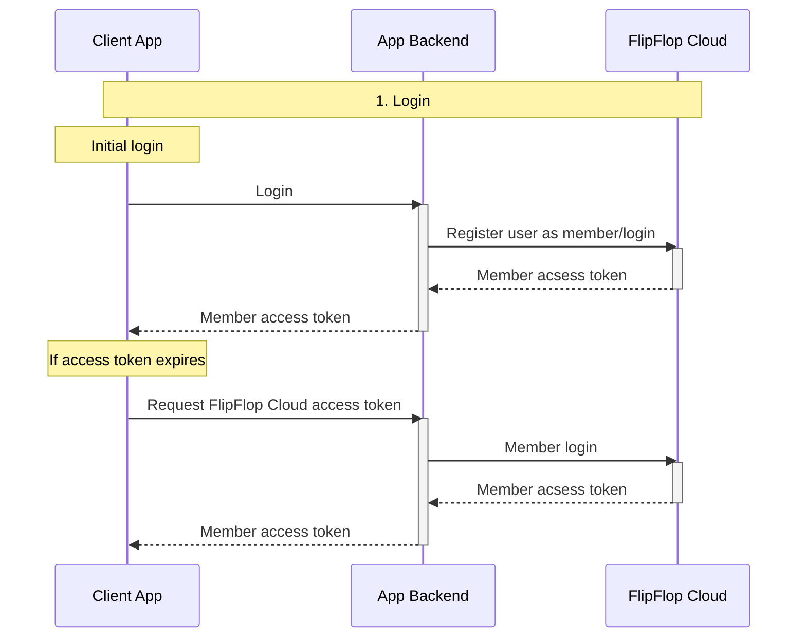
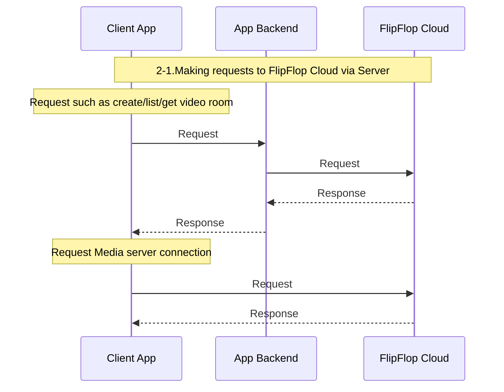
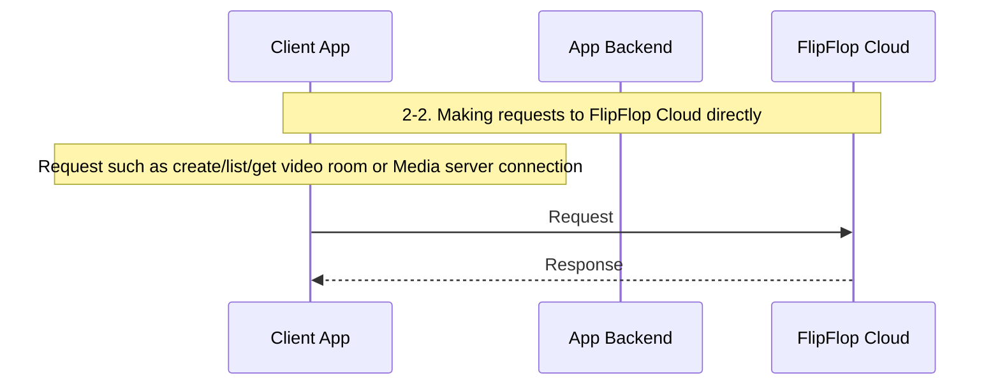

# Fully Customized Vicollo App

:::info

To use FlipFlop Cloud, you must first sign up as a user. However, currently, registration is only available through inquiry due to policy restrictions. For more information on how to register and subsequent usage procedures, please refer to [User Registration and Usage Procedures](./1-sign-up.md).

:::

## Introduction

FlipFlop Cloud provides video conferencing features that you can seamlessly integrate into your service, enabling you to offer video conferencing functionality to your users effortlessly.

This document explains how to implement Vicollo’s video conferencing functionality in your desired way and integrate it into your app, along with the various settings you can apply during the integration process. Unlike the method described in [Embedding Vicollo Video Room In Your Web App](../3-quick-start/4-embedding-vicollo-video-room-in-your-app.md), this approach is used when Vicollo’s UI features do not meet your requirements and you need to implement the UI entirely according to your own specifications.

## Preliminary Information

FlipFlop Cloud operates separate environments for testing and commercial use, depending on the purpose. Information about each environment is as follows:

| Endpoint Type | Sandbox Environment | Production Environment |
|:---:|:---:|:---:|
| User Console | https://console-sandbox.flipflop.cloud | https://console.flipflop.cloud |
| API | https://portal-sandbox.flipflop.cloud | https://portal.flipflop.cloud |
| Swagger UI | https://portal-sandbox.flipflop.cloud/open-api/ko/swagger-ui/ffc-app-server | https://portal.flipflop.cloud/open-api/ko/swagger-ui/ffc-app-server |
| API Documentation | https://portal-sandbox.flipflop.cloud/open-api/ko/docs/ffc-app-server | https://portal.flipflop.cloud/open-api/ko/docs/ffc-app-server |

:::warning

This document is focused on providing explanations for testing purposes, and all information is based on the sandbox environment.

:::

## Preparation

### Creating an Vicollo Unmanaged App

All features of FlipFlop Cloud operate within the framework of an app. Integrating Vicollo's video conferencing features into your service is only possible through the **"Vicollo Unmanaged App"**, which functions in an unmanaged form. This document focuses solely on the **Vicollo Unmanaged App**, so it will be referred to simply as the **"Vicollo App"** throughout.

:::note

For more information about the types of apps and their differences, please refer to the [Key Concepts > Apps documentation on FlipFlop Cloud App Types](../2-key-concepts/apps.md#types-of-flipflop-cloud-apps).

:::

If you inquired about using Vicollo with your service during the account issuance process, the account details you receive will include information about the **Vicollo App** created for that account. Currently, users cannot create **Vicollo Apps** independently. If you received an account for a different purpose and no **Vicollo App** was created, you will need to request its creation separately via inquiry. We are working to make Vicollo accessible without additional procedures in the near future.

### Using Vicollo App Server API

Fully customizing `Vicollo` requires using `FlipFlop Cloud`'s `Vicollo` server API from your backend server.

The Base URL for making API requests is as follows:

```plaintext
https://portal-sandbox.flipflop.cloud
```

When making requests, set the `Authorization` header as follows:

```plaintext
Basic {Base64-encoded string of "API key:secret"}
```

:::danger  
The Server API must **only** be used from your server.  
Using it in web or mobile apps could expose the API key/secret, leading to potential misuse, instability in FlipFlop Cloud operations, and financial damage to users.  
:::  

### FlipFlop Cloud Client SDK

If you want to implement the video room UI of your own for your client app, you need to use the FlipFlop Cloud Member API and Media Server API. To make these API calls and client app interactions more convenient, a client SDK is provided. The SDK assumes that the member is logged in and requires an access token for authentication. This access token must be issued through FlipFlop Cloud when the user logs into your service.

## Overview

To customize and integrate Vicollo’s video conferencing functionality into your service, you need to connect both your backend and frontend with Vicollo. The following sections describe the required integration tasks and how the system operates once the integration is complete.

### Integration Tasks and System Behavior

The diagrams below illustrate how to use the Vicollo App server API and client SDK.

- Client App refers to your client-side application.
- App Backend refers to your service’s backend.
- The Client App is implemented using the client SDK.
- The App Backend is implemented using the server API.

#### User Login

Issuing a FlipFlop Cloud member access token for a user can only be done via the server API, meaning it must be handled by your backend service. Therefore, when a user logs into your service, your backend must request an access token from FlipFlop Cloud and provide it to the user. Additionally, if the user’s FlipFlop Cloud member access token expires, the client must request a new token.



#### Using FlipFlop Cloud Features Through the App Backend

Once a user has obtained a FlipFlop Cloud member access token, the client can directly make requests to FlipFlop Cloud for actions such as creating or retrieving a video room. However, if you need to fine-tune user permissions based on your app's business logic, you should implement a system where users make these requests through your backend server instead.

On the other hand, joining a video room and utilizing actual video conferencing features must be done directly through FlipFlop Cloud rather than via your backend server. This means that while your backend can help manage permissions and access control, the actual video communication happens through a direct connection between the client and FlipFlop Cloud.



#### Direct Use of FlipFlop Cloud Features by the User

Once a user has obtained a FlipFlop Cloud member access token, the client can directly make requests to FlipFlop Cloud for actions such as creating or retrieving a video room.

If your app's business logic does not require fine-tuned control over user permissions, there is no need to route these requests through your backend server and marshal the requests. Instead, the client can directly communicate with FlipFlop Cloud as needed.



## Integration

### Backend Integration

#### User Login and Authorization

Your service's backend must either modify existing APIs or introduce new ones to support the necessary integration with FlipFlop Cloud.

- Modifications to Existing APIs
  - Login API: When a user logs into your service, the API must issue a FlipFlop Cloud member API access token for that user.
- New APIs
  - FlipFlop Cloud Member Access Token Renewal API: This API should allow users to renew their FlipFlop Cloud member API access token when the previously issued token expires.

The following sections outline the Vicollo App server APIs related to implementing member login and authentication token issuance.

- Create/Update Member ([Swagger UI](https://portal-sandbox.flipflop.cloud/open-api/en/swagger-ui/vicollo-app-server#/Vicollo%20App%20Members/VicolloAppsServerApiMembersController_upsertMember) / [API Documentation](https://portal-sandbox.flipflop.cloud/open-api/en/docs/vicollo-app-server#tag/Vicollo-App-Members/operation/VicolloAppsServerApiMembersController_upsertMember))
- List Members ([Swagger UI](https://portal-sandbox.flipflop.cloud/open-api/en/swagger-ui/vicollo-app-server#/Vicollo%20App%20Members/VicolloAppsServerApiMembersController_getMembers) / [API Documentation](https://portal-sandbox.flipflop.cloud/open-api/en/docs/vicollo-app-server#tag/Vicollo-App-Members/operation/VicolloAppsServerApiMembersController_getMembers))
- Get Member ([Swagger UI](https://portal-sandbox.flipflop.cloud/open-api/en/swagger-ui/vicollo-app-server#/Vicollo%20App%20Members/VicolloAppsServerApiMembersController_getMember) / [API Documentation](https://portal-sandbox.flipflop.cloud/open-api/en/docs/vicollo-app-server#tag/Vicollo-App-Members/operation/VicolloAppsServerApiMembersController_getMember))
- Issue Access Token or Login ([Swagger UI](https://portal-sandbox.flipflop.cloud/open-api/en/swagger-ui/vicollo-app-server#/Vicollo%20App%20Members/VicolloAppsServerApiMembersController_loginMember) / [API Documentation](https://portal-sandbox.flipflop.cloud/open-api/en/docs/vicollo-app-server#tag/Vicollo-App-Members/operation/VicolloAppsServerApiMembersController_loginMember))

#### FlipFlop Cloud API Gateway for Users

Optionally, if your service's business logic requires restricting users from creating or retrieving video rooms directly, you should implement an API that allows them to perform these actions through your backend service instead.

The following section covers the Vicollo App server API related to implementing video room creation, retrieval, and modification for members.

- Create Video-Room ([Swagger UI](https://portal-sandbox.flipflop.cloud/open-api/en/swagger-ui/vicollo-app-server#/Vicollo%20App%20Video-Rooms%20/VicolloAppsServerApiVideoRoomsController_createVideoRoom) / [API Documentation](https://portal-sandbox.flipflop.cloud/open-api/en/docs/vicollo-app-server#tag/Vicollo-App-Video-Rooms/operation/VicolloAppsServerApiVideoRoomsController_createVideoRoom))
- List Video-Rooms ([Swagger UI](https://portal-sandbox.flipflop.cloud/open-api/en/swagger-ui/vicollo-app-server#/Vicollo%20App%20Video-Rooms%20/VicolloAppsServerApiVideoRoomsController_listVideoRooms) / [API Documentation](https://portal-sandbox.flipflop.cloud/open-api/en/docs/vicollo-app-server#tag/Vicollo-App-Video-Rooms/operation/VicolloAppsServerApiVideoRoomsController_listVideoRooms))
- Get Video-Room ([Swagger UI](https://portal-sandbox.flipflop.cloud/open-api/en/swagger-ui/vicollo-app-server#/Vicollo%20App%20Video-Rooms%20/VicolloAppsServerApiVideoRoomsController_getVideoRoom) / [API Documentation](https://portal-sandbox.flipflop.cloud/open-api/en/docs/vicollo-app-server#tag/Vicollo-App-Video-Rooms/operation/VicolloAppsServerApiVideoRoomsController_getVideoRoom))
- Update Video-Room ([Swagger UI](https://portal-sandbox.flipflop.cloud/open-api/en/swagger-ui/vicollo-app-server#/Vicollo%20App%20Video-Rooms%20/VicolloAppsServerApiVideoRoomsController_updateVideoRoom) / [API Documentation](https://portal-sandbox.flipflop.cloud/open-api/en/docs/vicollo-app-server#tag/Vicollo-App-Video-Rooms/operation/VicolloAppsServerApiVideoRoomsController_updateVideoRoom))

### Frontend Development/Integration

The FlipFlop Cloud client SDK for frontend development and integration may have different APIs and usage depending on the platform. This section covers only the common aspects, and for platform-specific details, please refer to the respective SDK documentation for each platform.

- [Web](https://github.com/jocoos-public/ffc-sdk-client-javascript)
- [Android](https://github.com/jocoos-public/ffc-sdk-client-android-sample)
- [iOS](https://github.com/jocoos-public/ffc-sdk-client-ios-sample)

All client SDKs operate under the assumption that the user is logged in. Additionally, there are separate environments for testing and production, allowing you to choose which endpoint to use. Therefore, the SDK provides an interface for initialization or configuration using these two pieces of information. When using the SDK, make sure to specify the correct endpoint along with the FlipFlop Cloud member access token issued during the user's login to your service.

The SDK's API is broadly divided into two categories:

- REST API Server
- Media Server API

Generally, REST API server functions are called individually, whereas the media server API is exposed through the RTC Video Room object created via the SDK.

#### SDK REST API Server API

The **FlipFlop Cloud** API currently provides the following functionalities:  

- Retrieve personal information registered in **FlipFlop Cloud**  
- Create a video room  
- Retrieve a list of video rooms  
- Retrieve details of a video room  
- Issue media server authentication information and retrieve connection details for joining a video room  

#### SDK Media Server API

Connecting to the media server for video room participation, as well as **publishing** and **subscribing** to media streams for video conferencing, is handled through the `RTC Video Room` object. While the implementation may slightly differ between SDKs on different platforms, the general process for building a video conferencing UI using video rooms is as follows:  

1. Create an `RTC Video Room` object  
2. Register personal video and audio streams through the `RTC Video Room`  
3. Connect to the media server via the `RTC Video Room` to enter the video room  
4. Subscribe to other participants' video and audio streams through the `RTC Video Room`  

The behavior of `RTC Video Room`, including **publishing** and **subscribing** to video and audio streams, follows these principles. You should refer to the SDK documentation to implement the necessary features accordingly.  

##### RTC Video Room Structure and Operation

- Participants (Participant)
  - Every person joining an `RTC Video Room` is considered a **participant**, who can be categorized into:  
    - **Local Participant**: Refers to the user themselves (only one per client).  
    - **Remote Participants**: All other participants except the user.  
  - The **metadata** attribute of a participant can be converted into a JSON string, which contains member details, allowing identification of which user a participant represents.  

- Track Publication
  - When a participant **publishes** a stream, it is referred to as a **Track Publication**.  
  - **Local Participant's Track Publication**:  
    - Contains information about the video/audio streams the user has published.  
    - To publish a stream, a track must be created from the camera or microphone data, and a **TrackPublication** object should be generated from the track.  
    - The SDK provides simplified APIs to facilitate this process, making development easier.  
  - **Remote Participant's Track Publication**:  
    - Contains information about video/audio streams published by other participants.  
    - To **subscribe** to a stream, the system retrieves the **Track Publication** list from remote participants and determines which ones to subscribe to.  

- Connection
  - Creating an `RTC Video Room` object **does not mean** the user has entered the room; the **connect()** function must be called to join.  
  - **Local Participants** can create **Track Publications** before joining the video room.  
  - When joining a room:  
    - The **Local Participant's Track Publication** is automatically published.  
    - The system retrieves details about **Remote Participants** already in the room, including their **Track Publications**.  
    - New participants joining later will be detected through events triggered by the `RTC Video Room` object.

## Webhook Events

### Vicollo App Event Webhooks

Vicollo app events can be received by registering a **callback API (webhook)** to the app. These events provide useful information for managing and operating the app.

To register a callback API, refer to the following API documentation:  
[**Register Callback API to Vicollo App**](https://portal-sandbox.flipflop.cloud/vicollo-apps-server-api-docs#tag/Vicollo-App-Information-and-Settings/operation/VicolloAppsServerApiController_setCallbackApi)

### Event Data Structure

The event information is sent as a JSON payload in a **POST request** to the registered callback API endpoint.  
The JSON payload has the following format:

```json
{
  "id": "string",                  // Event ID
  "type": "string",                // Event type
  "app": {                         // Information about the app where the event originated
    "id": "number",                // App ID
    "state": "string",             // App entity state
    "name": "string",              // Name of the app
    "defaultRtmpOutputMode": "string"  // Not relevant to Vicollo
  },
  "data": "object",                // Additional information about the event
  "createdAt": "string"            // Date and time of the event in ISO string format
}
```

### Event Types

Below are examples of event types and the `data` field content formats that might be useful for managing and operating the Vicollo app.

#### 1. **`VIDEO_ROOM_PARTICIPANT_JOINED`**

Triggered when a participant joins a video room.
**Payload:**

```json
{
  "videoRoom": {
    "id": "number",
    "state": "string",
    "videoRoomState": "string",
    "type": "VIDEO_CONFERENCE",
    "title": "string | null",
    "channelId": "number",
    "sessionNo": "number"
  },
  "appUser": {
    "appUserId": "string",
    "appUserName": "string | null",
    "channelMemberType": "string",
    "customData": "object | null"
  },
  "joinedAt": "string"  // Date and time in ISO string format
}
```

#### 2. **`VIDEO_ROOM_PARTICIPANT_LEFT`**

Triggered when a participant leaves a video room.
**Payload:**

```json
{
  "videoRoom": {
    "id": "number",
    "state": "string",
    "videoRoomState": "string",
    "type": "VIDEO_CONFERENCE",
    "title": "string | null",
    "channelId": "number",
    "sessionNo": "number"
  },
  "appUser": {
    "appUserId": "string",
    "appUserName": "string | null",
    "channelMemberType": "string",
    "customData": "object | null"
  },
  "leftAt": "string"  // Date and time in ISO string format
}
```

#### 3. **`VIDEO_ROOM_EGRESS_ENDED`**

Triggered when the output stream (egress) of a video room ends.
**Payload:**

```json
{
  "videoRoom": {
    "id": "number",
    "state": "string",
    "videoRoomState": "string",
    "type": "VIDEO_CONFERENCE",
    "title": "string | null",
    "channelId": "number",
    "sessionNo": "number"
  }
}
```

#### 4. **`MEMBER_CREATED`**

Triggered when a new member is created.
**Payload format:** To Be Determined (TBD).

#### 5. **`MEMBER_UPDATED`**

Triggered when a member's details are updated.
**Payload format:** To Be Determined (TBD).

#### 6. **`VIDEO_ROOM_SCHEDULED`**

Triggered when a video room is scheduled.
**Payload format:** To Be Determined (TBD).

:::note

- All timestamps in the payload are in **ISO string format**.
- Use these events to synchronize your app's state, monitor user activity, and handle video room lifecycle events effectively.

:::
