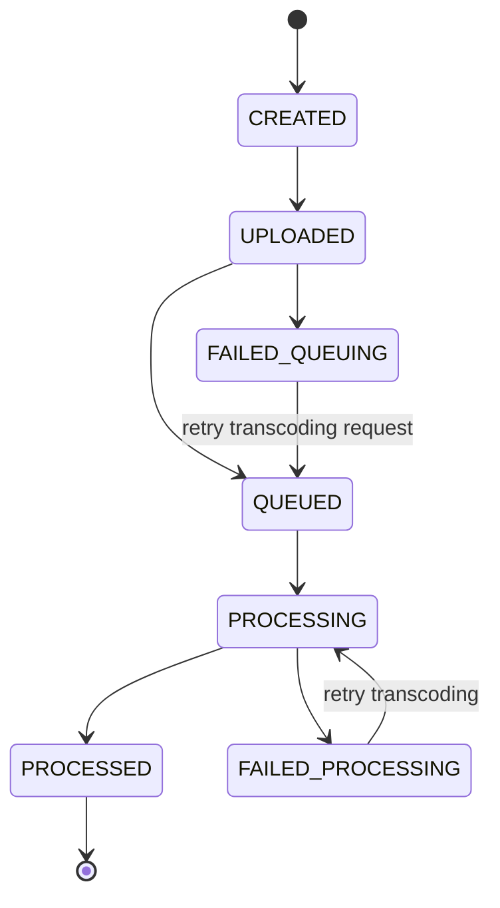

# 비디오 포스트

`비디오 포스트`는 비디오를 게시물 형태로 관리하는 단위로 사용자들이 비디오를 공유하는 기능을 위해 사용됩니다. 공유된 비디오를 시청할 때에는 압축된 형태로 시청해야 네트워크 대역폭을 절약할 수 있기 때문에 트랜스코딩 절차를 거치게 됩니다. 따라서 비디오를 공유하는 목적이 아닌 트랜스코딩을 하는 목적으로 사용할 때에도 `비디오 포스트`를 사용해야 합니다.

## 비디오 포스트 사용법

`비디오 포스트` 사용 방법은 다음과 같습니다.

1. `비디오 포스트` 생성
2. `비디오 포스트` 추가 설정
3. `비디오 포스트`에 원본 비디오 파일 업로드
4. 업로드된 원본 비디오 파일 트랜스코딩 자동 진행
5. 트랜스코딩 완료된 비디오 산출물 시청

각 단계에서의 자세한 사용법은 다음과 같습니다.

### 비디오 포스트 속성 및 생성

`비디오 포스트`에는 다음과 같은 속성들이 있습니다.

- 생성시 필수 속성
  - `appUserId`: `비디오 포스트`의 생성자이자 소유자. 서버 API를 사용하여 생성할 경우 꼭 명시해야 하며 클라이언트 API를 사용하여 생성할 경우에는 클라이언트 API를 요청하는 멤버가 생성자가 되어 명시할 필요가 없습니다.
- 읽기 전용 속성
  - `videoPostState`: `비디오 포스트`의 생명주기에 따른 상태
- 읽기/쓰기 속성
  - `title`: 제목
  - `description`: 설명
  - `accessLevel`: 접근 제한 범위로 현재는 모두에게 공개인 `PUBLIC`만 지원됨
  - `videoTranscodingProfileId`: 원본 비디오 파일에 사용할 트랜스코딩 프로파일 아이디로 설정하지 않으면 기본 값 사용하며 트랜스코딩 작업이 시작 되면 변경 불가능
  - `thumbnailTranscodingProfileId`: 썸네일을 추출하는데 사용할 트랜스코딩 프로파일 아이디로 설정하지 않으면 썸네일 추출하지 않으며 트랜스코딩 작업이 시작 되면 변경 불가능
  - `previewTranscodingProfileId`: 프리뷰를 추출하는데 사용할 트랜스코딩 프로파일 아이디로 설정하지 않으면 프리뷰를 추출하지 않으며 트랜스코딩 작업이 시작 되면 변경 불가능
  - `customData`: 임의의 정보를 key-value 쌍의 객체 형태로 저장할 수 있는 속성

위의 속성들을 설정하여 생성하면 상태가 `CREATED`인 `비디오 포스트`가 생성 됩니다.

### 비디오 포스트 추가 설정

`비디오 포스트`를 생성한 후에 트랜스코딩 프로파일과 관련된 속성을 제외하고는 대부분 변경이 가능합니다. 또 썸네일/프리뷰 트랜스코딩 프로파일을 통해 추출 가능하지만 파일을 업로드 함으로써 설정도 가능합니다.

### 비디오 포스트에 원본 비디오 파일 업로드

`비디오 포스트`에 해당하는 원본 비디오를 업로할 때에는 먼저 API로 업로드 주소를 요청해야 하며, 업로드 주소를 요청할 때에는 몇개의 조각으로 분할해서 업로드할지 설정할 수 있습니다. 설정한 분할 개수에 따라 업로드 URL이 응답으로 오며, 각 파일 조각을 각각의 업로드 URL로 업로드한 후에 업로드 완료 API를 호출 함으로써 `비디오 포스트`의 상태는 `UPLOADED`로 전환되며 **플립플랍 클라우드**에서 업로드된 파일 조각들을 하나의 파일로 조합을 완료하면 트랜스코딩를 작업이 내부적으로 요청되어 상태가 `QUEUED`로 변경 됩니다.

### 트랜스코딩 진행

트랜스코더에서 트랜스코딩 작업이 조회되어 시작되면 `비디오 포스트`의 상태는 `PROCESSING`으로 변경되고 작업이 완려되면 상태가 `PROCESSED`로 변경 됩니다. 트랜스코딩 작업이 완료된 `비디오 포스트`를 조회할 경우에 `file` 속성에 원본, 트랜스코딩된 산출물, 썸네일, 프리뷰 파일에 대한 정보가 담겨져 있게 됩니다.

## 비디오 포스트의 상태

`비디오 포스트`는 다음과 같은 상태를 가질 수 있습니다.

- 정상 상태
  - CREATED - 생성
  - UPLOADED - 업로드됨
  - QUEUED - 원본 비디오 파일의 트랜스코딩 요청 완료 (원본 시청 가능)
  - PROCESSING - 원본 비디오 파일 트랜스코딩중 (원본 시청 가능)
  - PROCESSED - 트랜스코딩 완료 (원본/트래스코딩본 시청 가능)
- 오류 상태
  - FAILED_UPLOAD - 업로드 실패 (시청 불가능)
  - FAILED_QUEUING - 트랜스코딩 요청 실패 (원본 시청 가능)
  - FAILED_PROCESSING - 트랜스코딩 실패 (원본 시청 가능)

그리고 상태의 흐름은 다음과 같습니다.

