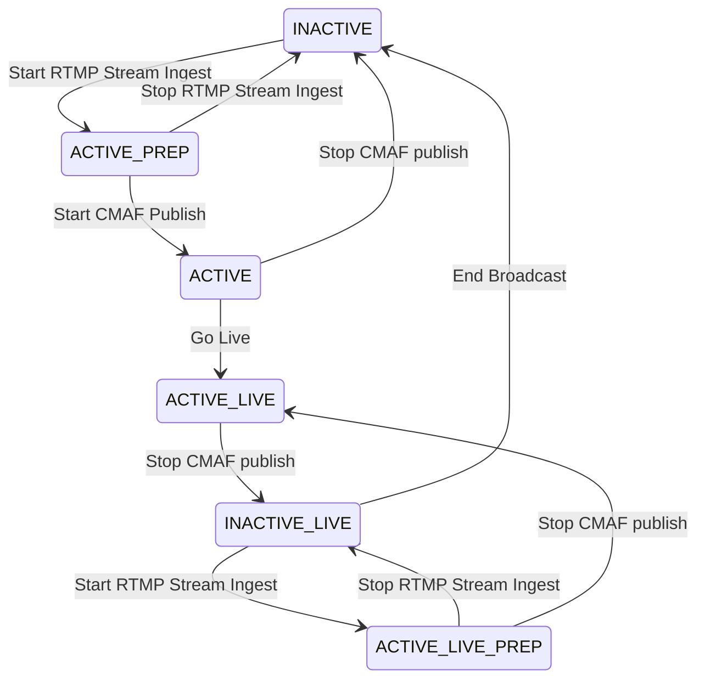
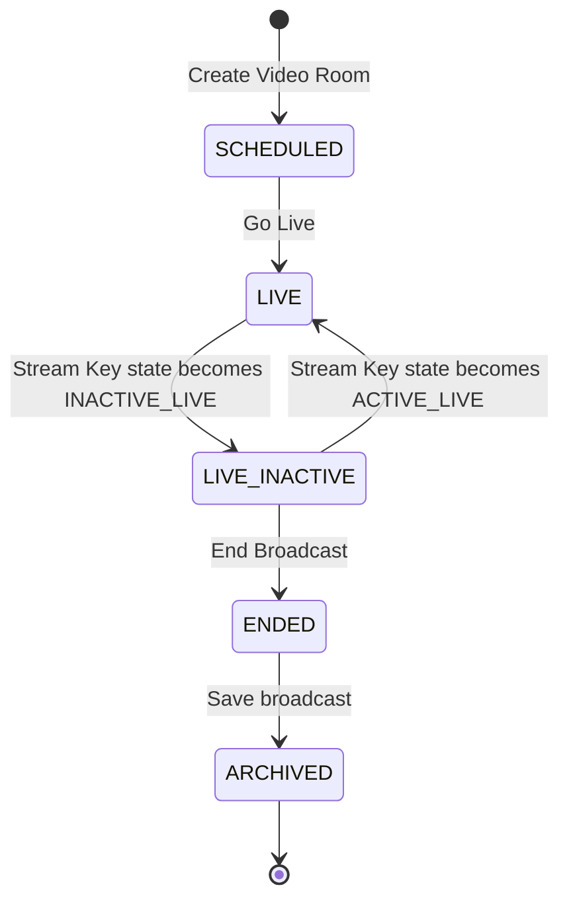

# 비디오 룸

`비디오 룸`은 사람들의 실시간 의사 소통및 상호작용을 비디오라는 매체를 사용할 수 있도록 해줍니다. 앞으로 다양한 방식이 추가될 예정이지만 현재는 다음 두가지 유형을 지원하고 있습니다.

- `BROADCAST_RTMP` - 라이브 스트림을 RTMP 프로토콜로 송출하여 RTMP/HTTP-FLV/HLS/MPEG-DASH로 시청할 수 있도록 하는 유형
- `VIDEO_CONFERENCE` - WebRTC를 사용해서 화상회의를 진행할 수 있는 유형

각 유형에 대한 자세한 설명은 다음과 같습니다.

## BROADCAST_RTMP 비디오 룸

이 유형의 `비디오 룸`은 방송을 하고자 하는 사람이 RTMP 프로토콜을 사용하여 비디오 스트림을 송출하여 다른 사람들이 RTMP, HTTP-FLV(FLV over HTTP), CMAF(HLS와 MPEG-DASH) 방식으로 비디오 스트림을 실시간으로 시청할 수 있게 해줍니다. `BROADCAST_RTMP` 유형의 `비디오 룸`에서 라이브 방송을 하기 위해서는 다음과 같은 과정을 거쳐 방송을 하게 됩니다

1. 등록한 멤버를 생성자로 지정하여 `비디오 룸`을 `BROADCAST_RTMP` 유형으로 생성
   - 현재 라이브 방송은 RTMP 스트림 송출을 통한 방법만 제공되며, 송출된 스트림을 다수가 시청하기 적합한 형태로 변환되어 출력되어 시청이 가능하도록 하고 있습니다. 출력은 CMAF(HLS와 MPEG-DASH)와 RTMP 형식을 지원하고 있습니다.
2. 비디오룸 생성자 멤버의 스트림키를 사용해서 RTMP 스트림을 플립플랍 클라우드로 송출
   - 각 멤버는 고유한 문자열인 스트림키를 가지고 있으며, 멤버가 방송을 하고자 하는 영상을 스트림으로 송출할 때 사용되는 URL에 명시하게 됩니다. 또 송출된 RTMP 스트림을 어떻게 변환하여 출력할지에 대한 설정도 스트림키를 통해서 하게 됩니다.
3. 비디오룸에서 방송 시작하여 실제 방송 시작
   - 송출된 RTMP 스트림이 시청이 가능한 형태로 변환이 되면 비디오룸을 통해 그 스트림이 방송 되도록 방송을 시작할 수 있습니다. 비디오룸에서 방송을 시작하면 송출되고 있는 RTMP 스트림이 시청 가능한 형태로 변환된 영상의 URL 정보가 갱신되어 그 정보를 통해 다른 멤버(또는 사람)들이 방송을 시청할 수 있게 됩니다.
4. 비디오룸의 URL을 시청자들에게 전달하여 시청할 수 있도록 하기
5. 비디오룸에서 방송 종료하기

위의 각 과정에서의 세부 사항과 자세한 설명은 다음과 같습니다.

### 1. 비디오룸 생성

비디오 생성시 다음 속성을 지정해서 생성할 수 있습니다.

- 필수
  - type: `BROADCAST_RTMP`
  - appUserId: `비디오룸`의 생성자이자 소유자. 서버 API를 사용하여 생성할 경우 꼭 명시해야 하며 클라이언트 API를 사용하여 생성할 경우에는 클라이언트 API를 요청하는 멤버가 생성자가 되어 명시할 필요가 없습니다.
  - scheduledAt: ISO 8601 형식의 문자열로 된 방송을 시작할 일시. 표시용으로 이 값이 특별한 기능에 사용되지는 않습니다.
- 선택
  - title: `비디오 룸`에서 진행할 라이브 방송의 제목
  - description: `비디오 룸`에서 진행할 방송에 대한 설명
  - access Level: `비디오 룸`에 대한 다른 멤버 또는 사람들의 접근 범위에 대한 값으로 현재는 `PUBLIC`만 지원되어 방송은 방송 시청 URL만 있으면 누구나 시청 가능하게 됩니다.

### 2. 비디오룸 생성자 멤버의 스트림키를 사용해서 RTMP 스트림을 FlipFlop Cloud로 송출

`스트림키`는 플립플랍 클라우드에서 송출된 RTMP 스트림이 인입 되었을 때 어떤 멤버가 송출한 스트림인지 판별하고 시청을 위해 변환해야 하는 출력 형식(RTMP/HTTP-FLV/CMAF)과 그 과정에서 사용해야 하는 `트랜스코딩 프로파일`을 판단하기 위해 사용 됩니다. 따라서 `스트림키`는 각 멤버에게 부여 되어 있고 서버 API를 통해 멤버에게 알려주거나 멤버가 클라이언트 API를 통해 자신의 스트림키를 직접 조회할 수 있습니다.

#### 방송 출력 모드 정하기

송출된 RTMP 스트림을 다음 4가지 형태로 변환되어 시청 가능합니다.

- `RTMP`: 송출된 RTMP 스트림을 RTMP 프로토콜로 시청 (다수의 사람이 지연시간을 2초 이내로 최소화하여 시청이 가능하지만 RTMP port가 막혀 있는 경우 시청이 불가능)
- `HTTP-FLV`: 송출된 RTMP 스트림을 FLV로 변환하여 HTTP 프로토콜로 시청 (다수의 사람이 지연시간을 2초 이내로 최소화하여 시청이 가능하고 RTMP 프로토콜로 시청하는 것 보다 접근성이 좋음)
- `HLS`: 송출된 RTMP 스트림을 HLS 형식으로 시청 (다수의 사람들이 지연시간이 약 8초로 조금 길지만 안정적이고 저렴하게 시청이 가능)
- `MPEG-DASH`: 송출된 RTMP 스트림을 MPEG-DASH 형식으로 시청 (다수의 사람들이 지연시간이 약 8초로 조금 길지만 안정적이고 저렴하게 시청이 가능)

그리고 방송의 출력 모드는 다음 세가지가 존재 합니다

- `RTMP` - `RTMP`와 `HTTP-FLV` 형식으로 출력
- `CMAF` - `HLS`와 `MPEG-DASH` 형식으로 출력
- `RTMP_CMAF` - `RTMP`, `HTTP-FLV`, `CMAF`, `MPEG-DASH` 형식 모두 출력

방송의 출력 모드로 원하는 출력 형식대로 시청이 가능하도록 할 수 있습니다. 출력 모드를 설정하는 방법은 크게 3가지가 있고 다음과 같은 우선순위를 가지고 적용 됩니다.

- RTMP 스트림 송출할 때 송출 URL에 설정: 송출 URL 뒤에 쿼리 파라메터로(예시: mode=RTMP)
- `스트림키`에 설정
- `앱`에 설정

#### RTMP 스트림 송출하기

RTMP 스트림을 송출하기 위해서는 `스트림키`를 조회한 응답에 다음 속성을 사용해야 합니다.

- `ingestURL`: RTMP 스트림 송출 소프트웨어나 플립플랍 클라우드 SDK를 사용해서 송출 지점로 설정해야 하는 URL
- `streamKey`: 송출에 사용해야 하는 실제 스트림키에 해당하는 문자열

이 두 정보를 다음과 같이 조합하여 RTMP 송출 소프트웨어나 플립플랍 클라우드 SDK에 최종 송출 지점으로 설정 합니다.

```shell
// 실제 사용해야 하는 송출 URL
${ingestURL}/${streamKey}

// 출력 모드까지 송출 URL에 설정할 경우
${ingestURL}/${streamKey}?mode=${mode}
```

#### 스트림키와 비디오룸의 상태

`스트림키`에는 `streamKeyState`라는 속성이 있고, `비디오 룸`에는 `videoRoomState`라는 속성이 있습니다. 이 두 속성은 `스트림키`와 `비디오 룸` 각각의 상태를 나타내는 속성입니다. `스트림키`를 사용한 RTMP 송출 현황, 그리고 그에 따른 `비디오 룸`의 방송 시작 여부 등에 따라 상태가 바뀝니다.

- `스트림키` 상태들
  - `INACTIVE` - 스트림키로 스트림 송출이 없는 상태
  - `ACTIVE_PREP` - 스트림키로 스트림 송출이 성공적으로 인지 된 상태
  - `ACTIVE` - 스트림키로 송출된 스트림이 시청 가능한 형태로 변환된 상태
  - `ACTIVE_LIVE` - 스트림키로 송출된 스트림이 시청 가능한 형태로 변환되어 비디오룸을 통해 시청 가능한 URL들이 노출되는 상태
  - `INACTIVE_LIVE` - 스트림키로 송출된 스트림이 중단 되어 방송이 중단 되었지만 다시 스트림 송출을 통해 방송이 재개될 수 있는 상태
  - `ACTIVE_LIVE_PREP` - 방송이 중단 되었다가 스트림 송출이 다시 재개 됨을 성공적으로 인지된 상태
- `스트림키` 상태의 흐름



- `비디오 룸` 상태
  - `SCHEDULED` - `비디오 룸` 생성된 상태
  - `LIVE` - 방송중인 상태
  - `LIVE_INACTIVE` - 방송 중단된 상태
  - `ENDED` - 방송 종료된 상태
  - `ARCHIVED` - 방송 녹화본을 VOD로 시청할 수 있는 `비디오 포스트` 생성된 상태
- `비디오 룸` 상태 흐름
  


### 3. 비디오룸에서 방송 시작하여 실제 방송 시작

멤버의 `스트림키`로 RTMP 스트림을 송출하여 `스트림키`의 상태가 `ACTIVE` 상태가 되면 해당 멤버가 생성한 `비디오 룸`에서 방송을 시작할 수 있습니다. 한 `스트림키`로 동시에 두개 이상의 방송을 하지 못하기 때문에 멤버는 동시에 두개 이상의 방송을 하지 못합니다. 따라서 한 `비디오 룸`에서 방송을 시작한 경우에 스트림 송출을 중단 하더라도 방송이 종료되지 않으면 다른 `비디오 룸`에서 방송을 새로 시작할 수 없습니다.

`비디오 룸`에서 방송이 시작되면 `스트림키`의 상태가 `ACTIVE_LIVE`로 전환되고, 해당 `비디오 룸`의 URL 정보들이 방송을 시청 가능한 URL들로 채워져서 노출 되어 `비디오 룸`을 매개로 방송을 시청할 수 있게 됩니다.

### 4. 비디오룸의 URL을 시청자들에게 전달하여 시청할 수 있도록 하기

방송이 진행중인 상태에서 방송을 시청하려고 하는 사람들에게 플립플랍 클라우 API를 사용해서 `비디오 룸`의 정보를 조회하여 시청 가능한 URL을 조회할 수 있게 하거나 URL 정보들을 방송을 시청하게 하고픈 사람들에게 직접 공유해서 방송을 시청하게 할 수 있습니다. URL이 있으면 누구든지 시청 가능한 이유는 `비디오 룸`의 접근제한 설정이 현재는 `PUBLIC`만 지원하기 때문이며 추후에는 접근 범위를 세분화하여 조절이 가능하도록 기능이 추가될 예정입니다.

### 5. 비디오룸에서 방송 종료하기

방송을 종료하면 방송중에 스트림 송출을 중단 했을 때 스트림 송출을 재개해서 방송을 재개할 수 있는것과 다르게 방송이 다시 시작 될 수 없습니다.
방송을 종료하는 정석적이고 권장 드리는 방법은 스트림 송출을 중단하고 `스트림키`의 상태가 `INACTIVE_LIVE`가 되었을 때 방송을 종료 하는 것입니다.

이와 다른 방법으로는 방송을 강제 종료하는 방법이 있습니다. 이 방법을 사용하면 어떤 시점이든지 방송 종료가 가능하지만 멤버의 `스트림키`가 갱신되어 변경되어 `스트림키` 조회를 다시 하고 스트림 송출 소프트웨어에서의 설정을 변경해야 하는 번거로움이 있을 수 있습니다. 방송 강제 종료시에 스트림키를 갱신하는 이유는 `스트림키`가 탈취되어 스트림키의 주인의 의도와 다르게 사용되어 불건전한 내용이 방송이 될 경우 다시 방송을 쉽게 진행할 수 없도록 하기 위함 입니다.

방송이 종료 되면 `스트림키`의 상태는 다시 `INACTIVE`로 초기화 되어 다른 비디오룸에서 방송을 다시 시작할 수 있는 상태가 됩니다.

종료된 방송은 자동으로 방송 시작 시점 부터 종료된 시점까지의 라이브 스트림의 녹화본을 VOD 형태로 시청할 수 있도록 전환하는 작업이 진행 됩니다. VOD는 `비디오 포스트`를 자동으로 생성시켜 녹화본을 원본을 올린 후에 VOD에 적합한 `트랜스코딩 프로파일`을 사용하여 트랜스코딩하게 됩니다.

VOD로 전환되는 `비디오 포스트`에 대한 정보는 `비디오 룸` 조회시 `videoPostId` 속성을 통해서 알 수 있습니다. `비디오 룸`의 VOD State가 `ARCHIVING`이면 트랜스코딩이 이루어지는 중이고, `ARCHIVED`로 전환되면 트랜스코딩이 끝난 상태가 되어 `비디오 포스트`를 id로 조회하여 결과물을 확인할 수 있습니다.

## VIDEO_CONFERENCE 비디오 룸

이 유형의 `비디오 룸`은 현재 플립플랍 클라우드의 제품중에 하나인 **Vicollo**를 통해서만 사용 가능합니다.
