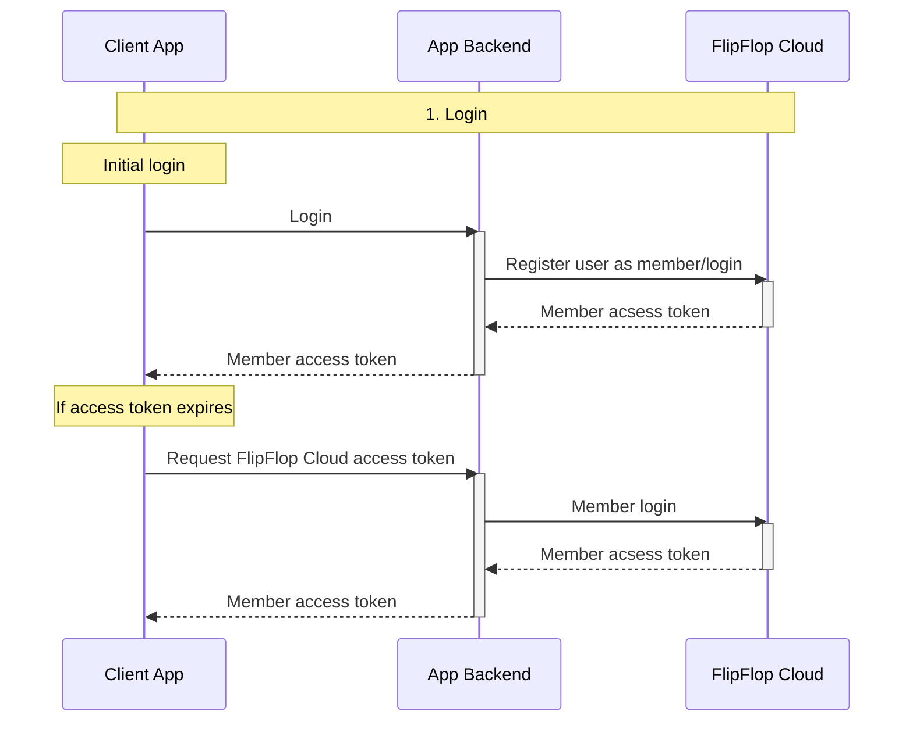
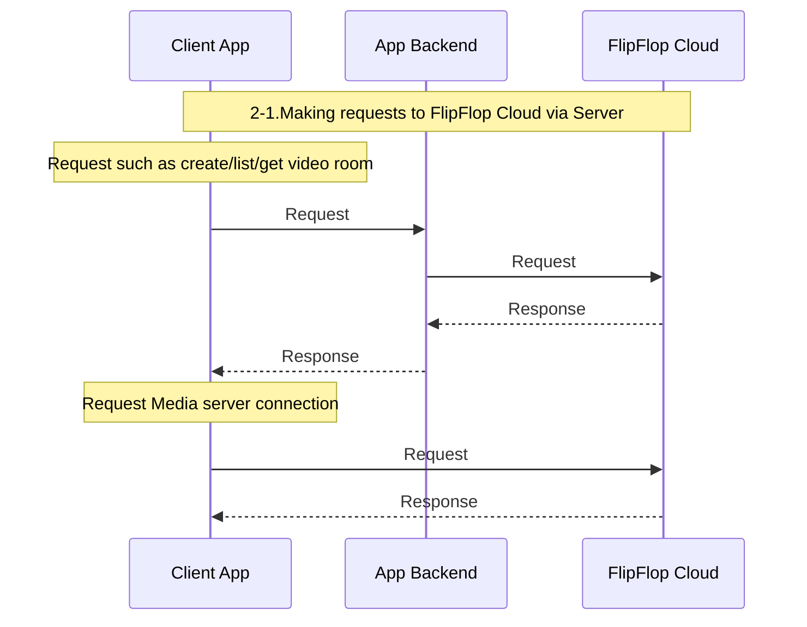
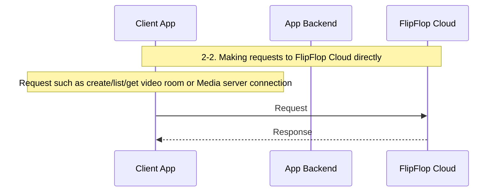

# 비콜로 커스텀으로 개발해서 사용하기

:::info

플립플랍 클라우드를 사용하기 위해서는 사용자로 가입하는 단계가 선행 되어야 합니다. 하지만 현재는 정책상 문의를 통해서 가입 요청만 받고 있습니다. 플립플랍 클라우드를 가입 및 그에 따른 추후 사용 절차는 [사용자 가입 및 사용 절차](./1-sign-up.md)를 참고 바랍니다.

:::

## 개요

플립플랍 클라우드는 화상회의 기능을 제공하며, 이를 여러분의 서비스에 손쉽게 통합하여 사용자들에게 화상회의 기능을 간편하게 제공할 수 있습니다.

이 문서는 `비콜로`의 화상회의 기능을 원하는 형태로 구현하여 여러분의 앱에 통합하는 방법과 통합 과정에서 적용할 수 있는 다양한 설정에 대해 안내합니다. 이 방법은 [비콜로 비디오룸 웹앱에서 사용하기](../3-quick-start/4-embedding-vicollo-video-room-in-your-app.md) 방법과 달리 비콜로의 UI 기능이 요구사항에 맞지 않을 때 UI까지 모두 원하는 형태로 구현할 필요가 있을 때 사용하는 방법 입니다.

## 사전 정보

`플립플랍 클라우드`는 사용 목적에 따라 테스트를 위한 환경과 상업적 사용을 위한 환경이 별도로 운영 되고 있습니다. 각 환경별 정보는 다음과 같습니다.

| Endpoint 유형 | Sandbox 환경 | Production 환경 |
|:---:|:---:|:---:|
| 유저 콘솔 | https://console-sandbox.flipflop.cloud | https://console.flipflop.cloud |
  | API | https://portal-sandbox.flipflop.cloud | https://portal.flipflop.cloud |
| Swagger UI | https://portal-sandbox.flipflop.cloud/open-api/ko/swagger-ui/ffc-app-server | https://portal.flipflop.cloud/open-api/ko/swagger-ui/ffc-app-server |
| API 문서 | https://portal-sandbox.flipflop.cloud/open-api/ko/docs/ffc-app-server | https://portal.flipflop.cloud/open-api/ko/docs/ffc-app-server |

:::warning

본 문서는 테스트를 위한 설명을 목적을 두고 있기 때문에 모든 정보를 sadnbox 환경 기준으로 작성 되었습니다.

:::

## 선행조건

### 비콜로 언매니지드 앱 생성

`플립플랍 클라우드`의 모든 기능은 앱이라는 단위 안에서 이루어지며 비콜로의 화상회의 기능을 여러분의 서비스에 가져다 사용하는 것은 `언매니지드` 형태로 동작하는 `비콜로 앱`인 `비콜로 언매니지드 앱`을 통해서만 가능합니다. 이 문서에서는 `비콜로 언매니지드 앱`만 다루기 때문에 이하에서는 `비콜로 앱`으로만 표기 합니다.

:::note

앱의 종류와 차이점에 대해서는 [주요 개념 > 앱 문서의 플립플랍 클라우드 앱 종류 문서](../2-key-concepts/apps.md#플립플랍-클라우드-앱의-종류)를 참고 바랍니다.

:::

가입 문의를 통해 계정을 발급 받는 과정에서 여러분의 서비스에 비콜로를 사용하는 방법에 대한 문의를 하셨다면 계정 정보와 함께 그 계정으로 생성한 `비콜로 앱`에 대한 정보가 같이 제공 됩니다. 현재는 사용자가 `비콜로 앱`을 생성할 수 있는 방법이 제공되지 않아 다른 목적으로 계정 발급을 받아 생성된 `비콜로 앱`이 없다면 별도로 문의를 통해 생성을 요청해야 합니다. 빠른 시일 내에 비콜로를 별다른 절차 없이 사용할 수 있도록 노력하겠습니다.

### 비콜로 앱 서버 API 호출하기

`비콜로 앱`을 커스텀으로 개발해서 사용하기 위해서는 여러분 서비스의 백엔드 서버에서 `플립플랍 클라우드`의 `비콜로` 앱 서버 API를 호출해야 할 필요성이 있습니다.

API 요청에 사용할 Base URL은 https://portal-sandbox.flipflop.cloud 입니다. 요청에 `Authorization` 헤더를 다음과 같이 지정해 줍니다.

```plaintext
Basic {API key/secret을 ':'를 사이에 둔 문자열을 base64 인코딩한 문자열}
```

:::danger

서버 API는 웹/모바일 앱에서 사용하면 API key/secret이 노출되어 오남용의 문제가 발생하여 플립플랍 클라우드의 안정적인 운영 및 사용자의 금전적 피해가 발생할 수 있으니 꼭 서버에서만 사용해야 합니다.

:::

### 플립플랍 클라우드 클라이언트 SDK

여러분의 클라이언트 앱에서 사용자가 비디오룸에 입장했을 때의 UI를 직접 구현하려면 `플립플랍 클라우드`의 멤버 API와 미디어 서버 API를 사용해야 하며, 이러한 API 호출과 클라이언트 앱의 동작을 보다 편리하게 하기 위해 클라이언트 SDK가 제공 되고 있습니다. SDK는 멤버가 로그인된 상태인 것을 전제 하며, 인증을 위해 액세스 토큰이 필요합니다. 이 액세스 토큰은 사용자가 여러분의 서비스에 로그인할 때 플립플랍 클라우드를 통해 발급받아야 제공해야 합니다.

## 개괄

`비콜로`의 화상회의 기능을 커스텀으로 개발하여 여러분의 서비스에서 사용하기 위해서는 여러분 서비스의 백엔드와 프론트엔드에 각각 연동시키는 작업이 필요 합니다. 다음은 필요한 연동 작업과 연동 작업을 완료 했을 때의 동작 모습을 설명 합니다.

### 연동 작업 및 동작 설명

아래에 나오는 도표들은 `비콜로 앱` 서버 API 및 클라이언트 SDK 사용 방식에 대한 묘사입니다.

Client App은 어려분의 클라이언트 앱이며, App Backend는 어려분 서비스의 백엔드 입니다. Client App은 클라이언트 SDK를 사용해서 구현하고, App Backend는 서버 API를 사용하여 구현하게 됩니다.

#### 로그인

사용자에게 `플립플랍 클라우드`의 멤버 액세스 토큰을 발급하는 작업은 서버 API로만 가능하기 때문에 반드시 여러분 서비스의 백엔드 서비스에서 처리해야 합니다. 따라서 사용자가 여러분의 서비스에 로그인할때 로그인을 처리하는 과정에서 `플립플랍 클라우드`요청하여 결과를 사용자에게 전달해야 합니다. 또한 클라이언트에서 사용자의 `플립플랍 클라우드` 멤버 액세스 토큰이 만료 되었을 때 다시 발급 받아야 합니다.



#### 사용자의 플립플랍 클라우드 기능 앱 백엔드 통해서 사용하기

사용자가 `플립플랍 클라우드`의 멤버 액세스 토큰을 발급 받은 후에는 클라이언트에서 직접 `플립플랍 클라우드`에 비디오룸 생성/조회 등과 같이 필요한 요청을 할 수 있습니다. 하지만 여러분 앱의 비즈니스 로직에 따라서 사용자별로 이런 권한을 세부 조정하고 싶은 경우에는 사용자가 백엔드 서버를 통해서 요청하게 하여 구현해야 합니다.

반면 `비디오룸` 입장과 실질적인 화상회의 기능은 `플립플랍 클라우드`를 통해서 직접 사용해야 하기 때문에 여러분의 백엔드 서버를 통한 방식이 아닌 `플립플랍 클라우드`에 직접 접속하여 사용해야 합니다.



#### 사용자의 플립플랍 클라우드 기능 직접

사용자가 `플립플랍 클라우드`의 멤버 액세스 토큰을 발급 받은 후에는 클라이언트에서 직접 `플립플랍 클라우드`에 비디오룸 생성/조회 등과 같이 필요한 요청을 할 수 있습니다. 여러분 앱의 비즈니스 로직에서 사용자별로 이런 권한을 세부 조정하지 않아도 된다면 백엔드 서버를 통하지 않고 `플립플랍 클라우드`에 필요한 요청을 직접 해도 무방합니다.



## 연동 작업

### 백엔드 연동

#### 사용자의 로그인 및 인증정보 관련

여러분 서비스의 백엔드 서비스에는 필수적으로 다음의 API에 기능이 추가 되거나 새로운 기능의 API가  추가 되어 있어야 합니다.

- 기본 API의 변경 사항
  - 로그인 API: 사용자가 여러분의 서비스에 로그인할 때 그 사용자를 위한 `플립플랍 클라우드` 멤버 API 액세스 토큰 발급
- 추가 API
  - `플립플랍 클라우드` 멤버 액세스 토큰 재발급: 사용자에게 발급된 `플립플랍 클라우드` 멤버 API 액세스 토큰이 만료 되었을 때 갱신할 수 있는 API

다음은 멤버의 로그인과 인증정보 발급과 관련된 사항을 구현하는 작업과 관련된 `비콜로 앱` 서버 API 입니다.

- 멤버 생성/등록 ([Swagger UI](https://portal-sandbox.flipflop.cloud/open-api/ko/swagger-ui/ffc-app-server#/%EB%A9%A4%EB%B2%84%20%EA%B4%80%EB%A0%A8/AppsServerApiMembersController_upsertMember) / [API Documentation](https://portal-sandbox.flipflop.cloud/open-api/en/docs/ffc-app-server#tag/Members/operation/AppsServerApiMembersController_upsertMember))
- 멤버 목록 조회 ([Swagger UI](https://portal-sandbox.flipflop.cloud/open-api/ko/swagger-ui/ffc-app-server#/%EB%A9%A4%EB%B2%84%20%EA%B4%80%EB%A0%A8/AppsServerApiMembersController_listMembers) / [API Documentation](https://portal-sandbox.flipflop.cloud/open-api/en/docs/ffc-app-server#tag/Members/operation/AppsServerApiMembersController_listMembers))
- 멤버 조회 ([Swagger UI](https://portal-sandbox.flipflop.cloud/open-api/ko/swagger-ui/ffc-app-server#/%EB%A9%A4%EB%B2%84%20%EA%B4%80%EB%A0%A8/AppsServerApiMembersController_getMember) / [API Documentation](https://portal-sandbox.flipflop.cloud/open-api/en/docs/ffc-app-server#tag/Members/operation/AppsServerApiMembersController_getMember))
- 멤버 삭제 ([Swagger UI](https://portal-sandbox.flipflop.cloud/open-api/ko/swagger-ui/ffc-app-server#/%EB%A9%A4%EB%B2%84%20%EA%B4%80%EB%A0%A8/AppsServerApiMembersController_deleteMember) / [API Documentation](https://portal-sandbox.flipflop.cloud/open-api/en/docs/ffc-app-server#tag/Members/operation/AppsServerApiMembersController_deleteMember))
- 멤버 로그인 또는 멤버 액세스 토큰 발급 ([Swagger UI](https://portal-sandbox.flipflop.cloud/open-api/ko/swagger-ui/ffc-app-server#/%EB%A9%A4%EB%B2%84%20%EA%B4%80%EB%A0%A8/AppsServerApiMembersController_loginMember) / [API Documentation](https://portal-sandbox.flipflop.cloud/open-api/en/docs/ffc-app-server#tag/Members/operation/AppsServerApiMembersController_loginMember))

#### 사용자의 플립플랍 클라우드 기능 사용

그리고 선택적으로 여러분 서비스의 비즈니스 로직에 따라 사용자의 비디오룸 생성/조회를 제한하려면 사용자가 그 작업을 여러분 서비스의 백엔드를 통해서 할 수 있도록 API를 추가 합니다.

다음은 멤버의 비디오룸 생성/조회/수정과 관련된 사항을 구현하는 작업과 관련된 `비콜로 앱` 서버 API 입니다.

- 비디오룸 생성 ([Swagger UI](https://portal-sandbox.flipflop.cloud/open-api/ko/swagger-ui/ffc-app-server#/%EB%B9%84%EB%94%94%EC%98%A4%EB%A3%B8%20%EA%B4%80%EB%A0%A8/AppsServerApiVideoRoomsController_createVideoRoom) / [API Documentation](https://portal-sandbox.flipflop.cloud/open-api/en/docs/ffc-app-server#tag/Video-Rooms/operation/AppsServerApiVideoRoomsController_createVideoRoom))
- 비디오룸 목록 조회 ([Swagger UI](https://portal-sandbox.flipflop.cloud/open-api/ko/swagger-ui/ffc-app-server#/%EB%B9%84%EB%94%94%EC%98%A4%EB%A3%B8%20%EA%B4%80%EB%A0%A8/AppsServerApiVideoRoomsController_listVideoRooms) / [API Documentation](https://portal-sandbox.flipflop.cloud/open-api/en/docs/ffc-app-server#tag/Video-Rooms/operation/AppsServerApiVideoRoomsController_listVideoRooms))
- 비디오룸 조회 ([Swagger UI](https://portal-sandbox.flipflop.cloud/open-api/ko/swagger-ui/ffc-app-server#/%EB%B9%84%EB%94%94%EC%98%A4%EB%A3%B8%20%EA%B4%80%EB%A0%A8/AppsServerApiVideoRoomsController_getVideoRoom) / [API Documentation](https://portal-sandbox.flipflop.cloud/open-api/en/docs/ffc-app-server#tag/Video-Rooms/operation/AppsServerApiVideoRoomsController_getVideoRoom))
- 비디오룸 업데이트 ([Swagger UI](https://portal-sandbox.flipflop.cloud/open-api/ko/swagger-ui/ffc-app-server#/%EB%B9%84%EB%94%94%EC%98%A4%EB%A3%B8%20%EA%B4%80%EB%A0%A8/AppsServerApiVideoRoomsController_updateVideoRoom) / [API Documentation](https://portal-sandbox.flipflop.cloud/open-api/en/docs/ffc-app-server#tag/Video-Rooms/operation/AppsServerApiVideoRoomsController_updateVideoRoom))
- 비디오룸 삭제 ([Swagger UI](https://portal-sandbox.flipflop.cloud/open-api/ko/swagger-ui/ffc-app-server#/%EB%B9%84%EB%94%94%EC%98%A4%EB%A3%B8%20%EA%B4%80%EB%A0%A8/AppsServerApiVideoRoomsController_deleteVideoRoom) / [API Documentation](https://portal-sandbox.flipflop.cloud/open-api/en/docs/ffc-app-server#tag/Video-Rooms/operation/AppsServerApiVideoRoomsController_deleteVideoRoom))

### 프론트엔드 개발/연동

프론트엔드의 개발과 연동을 위한 `플립플랍 클라우드` 클라이언트 SDK는 플랫폼에 따라 API가 다르고 사용법이 약간 다를 수 있습니다. 여기서는 공통 사항만 다루고 나머지는 다음의 각 플랫폼의 SDK 문서를 참고 바랍니다.

- [웹](https://github.com/jocoos-public/ffc-sdk-client-javascript)
- [안드로이드](https://github.com/jocoos-public/ffc-sdk-client-android-sample)
- [iOS](https://github.com/jocoos-public/ffc-sdk-client-ios-sample)

모든 클라이언트 SDK는 로그인된 사용자를 전제로 동작하며 여러분의 테스트를 위한 테스트 환경과 실제 서비스에 사용되는 운영 환경이 분리 되어 있어서 어떤 환경의 엔드포인트를 사용할 것인지 선택할 수 있도록 되어 있습니다. 따라서 SDK를 두 정보로 초기화 하거나 설정하는 인터페이스가 존재 합니다. 클라이언트에서 사용자가 여러분 서비스의 로그인하면서 발급 받은 `플립플랍 클라우드` 멤버 액세스 토큰과 함께 사용하려고 하는 환경의 엔드포인트를 정확히 명기 바랍니다.

SDK의 API는 크게 `플립플랍 클라우드`의 Rest API 서버용과 미디어 서버용으로 나뉩니다. 일반적으로 Rest API 서버용 API는 함수 단위로 호출하게 되며, 미디어 서버용 API는 SDK를 통해 생성한 `RTC 비디오룸` 객체를 통해서 API가 노출 되어 있습니다.

#### SDK의 Rest API 서버용 API

`플립플랍 클라우드` API와 관련된 API는 현재 다음과 같은 기능이 존재 합니다.

- `플립플랍 클라우드`에 등록된 본인의 정보 조회
- 비디오룸 생성
- 비디오룸 목록 조회
- 비디오룸 상세 조회
- 비디오룸 입장을 위한 미디어 서버 인증 정보 발급 및 접속 정보 조회

#### SDK의 미디어 서버용 API

비디오룸 참여를 위한 미디어 서버 접속 및 회상 회의를 위한 스트림의 발행(publish)와 구독(subscribe)는 `RTC 비디오룸` 객체를 통해서 이루어 집니다. 플랫폼에 따른 SDK별로 약간 상이할 수 있으나 전반적으로 다음과 같은 과정을 통해 사용자의 비디오룸을 통한 화상회의 UI를 구현하게 됩니다.

1. `RTC 비디오룸` 객체 생성
2. `RTC 비디오룸`을 통해 나의 영상, 음성 스트림 등록
3. `RTC 비디오룸`을 통해 미디어 서버에 접속함으로써 비디오룸에 입장
4. `RTC 비디오룸`을 통해 다른 사람의 영상, 음성 스트림 구독

`RTC 비디오룸`의 동작 및 영상, 음성의 발행 및 구독은 다음과 같이 이루어지게 됩니다. 이 내용을 기반으로 필요한 기능을 SDK 문서에서 찾아 사용해야 합니다.

##### RTC 비디오룸의 구성 및 동작

- 참여자 (Participant)
  - `RTC 비디오룸`에 참여하는 모든 사람을 참여자(Participant)라고 지칭하며 참여자는 다음과 같이 두 분류로 다시 나눌 수 있습니다.
    - 로컬 참여자(Local Participant) - 본인을 의미하며 한명
    - 원격 참여자(Remote Participant) - 본인을 제외한 다른 참여자들을 의미
  - 참여자(Participant)의 속성 중에 metadta의 문자열을 JSON으로 변환하면 멤버의 정보가 있어 어떤 멤버에 해당하는 참여자인지 분간할 수 있습니다.
- 발행물 (Track Publication)
  - 각 참여자는 스트림을 발행(Publish) 했을 경우에 발행물(Publication)이 있다고 지칭합니다.
  - 로컬 참여자(Local Participant)의 발행물(Track Publication)은 본인이 발행(Publish)한 영상/음성 스트림에 대한 정보 입니다.
    - 스트림을 발행(Publish)할 경우에 후에 카메라 혹은 마이크로 부터 데이터를 수집해서 영상 또는 음성으로 만들어주는 Track을 생성한 후에 TrackPublication 객체를 Track으로 부터 생성하면 됩니다. (SDK에서 이 작업의 복잡성을 고려하여 개발의 편의를 위해서 일련의 작업을 간단하게 해주는 API 존재)
  - 원격 참여자(Remote Participant)의 발행물(Track Publication)은 다른 참여자가 발행(Publish)한 영상/음성 스트림에 대한 정보 입니다.
    - 스트림을 구독(Subscribe)할 경우에는 원격 참여자(Remote Participant)들의 발행물(Track Publication) 목록을 통해서 구독 여부를 설정
- 접속
  - `RTC 비디오룸` 객체의 생성은 비디오룸의 입장을 의미하지 않으며 입장을 위해서는 객체의 접속(connect) 함수를 사용해야 합니다.
  - 로컬 참여자(Local Participant)는 `비디오룸`에 입장하지 않더라도 발행물(TrackPublication)을 미리 생성할 수 있습니다.
  - 입장시
    - 로컬 참여자(Local Participant)의 발행물(Track Publication)은 자동으로 발행 됩니다.
    - 이미 입장한 원격 참여자(Remote Participant)들의 정보를 조회 가능하며 각 참여자의 발행물(Track Publication)들에 대한 정보도 조회 가능 합니다.
    - 추후에 입장한 원격 참여자(Remote Participant)들은 `RTC 비디오룸` 객체에 발생하는 이벤트를 통해서 알 수 있습니다.

## 웹훅으로 이벤트 받기

### 비콜로 앱 이벤트 웹훅

비콜로 앱에서 발생하는 이벤트는 앱에 **콜백 API(웹훅)**를 등록하여 수신할 수 있습니다. 이러한 이벤트는 앱을 관리하고 운영하는 데 유용한 정보를 제공합니다.

콜백 API를 등록하려면 다음 API 문서를 참고하세요:
[**비콜로 앱에 콜백 API 등록**](https://portal-sandbox.flipflop.cloud/vicollo-apps-server-api-docs#tag/Vicollo-App-Information-and-Settings/operation/VicolloAppsServerApiController_setCallbackApi)

### 이벤트 데이터 구조

이벤트 정보는 **POST 요청**의 JSON 페이로드 형식으로 등록된 콜백 API 엔드포인트로 전송됩니다.  
JSON 페이로드의 구조는 다음과 같습니다:

```json
{
  "id": "string",                  // 이벤트 ID
  "type": "string",                // 이벤트 타입
  "app": {                         // 이벤트가 발생한 앱의 정보
    "id": "number",                // 앱 ID
    "state": "string",             // 앱 상태
    "name": "string",              // 앱 이름
    "defaultRtmpOutputMode": "string"  // 비콜로와 관련 없음
  },
  "data": "object",                // 이벤트의 추가 정보
  "createdAt": "string"            // ISO 문자열 형식의 이벤트 발생 날짜 및 시간
}
```

### 이벤트 타입

아래는 비콜로 앱을 관리 및 운영하는 데 유용한 주요 이벤트 타입과 `data` 필드의 예시입니다.

#### 1. **`VIDEO_ROOM_PARTICIPANT_JOINED`**

참가자가 비디오룸에 입장했을 때 발생합니다.
**페이로드 예시:**

```json
{
  "videoRoom": {
    "id": "number",
    "state": "string",
    "videoRoomState": "string",
    "type": "VIDEO_CONFERENCE",
    "title": "string | null",
    "channelId": "number",
    "sessionNo": "number"
  },
  "appUser": {
    "appUserId": "string",
    "appUserName": "string | null",
    "channelMemberType": "string",
    "customData": "object | null"
  },
  "joinedAt": "string"  // ISO 문자열 형식의 입장 시간
}
```

#### 2. **`VIDEO_ROOM_PARTICIPANT_LEFT`**

참가자가 비디오룸에서 퇴장했을 때 발생합니다.
**페이로드 예시:**

```json
{
  "videoRoom": {
    "id": "number",
    "state": "string",
    "videoRoomState": "string",
    "type": "VIDEO_CONFERENCE",
    "title": "string | null",
    "channelId": "number",
    "sessionNo": "number"
  },
  "appUser": {
    "appUserId": "string",
    "appUserName": "string | null",
    "channelMemberType": "string",
    "customData": "object | null"
  },
  "leftAt": "string"  // ISO 문자열 형식의 퇴장 시간
}
```

#### 3. **`VIDEO_ROOM_EGRESS_ENDED`**

비디오룸의 출력 스트림(egress)이 종료되었을 때 발생합니다.
**페이로드 예시:**

```json
{
  "videoRoom": {
    "id": "number",
    "state": "string",
    "videoRoomState": "string",
    "type": "VIDEO_CONFERENCE",
    "title": "string | null",
    "channelId": "number",
    "sessionNo": "number"
  }
}
```

#### 4. **`MEMBER_CREATED`**

새로운 멤버가 생성되었을 때 발생합니다.
**페이로드 형식:** 추후 확정(TBD).

#### 5. **`MEMBER_UPDATED`**

멤버의 정보가 업데이트되었을 때 발생합니다.
**페이로드 형식:** 추후 확정(TBD).

#### 6. **`VIDEO_ROOM_SCHEDULED`**

비디오룸이 예약되었을 때 발생합니다.
**페이로드 형식:** 추후 확정(TBD).

:::note

- 페이로드 내 모든 시간 정보는 **ISO 문자열 형식**입니다.
- 이러한 이벤트를 활용하여 앱의 상태를 동기화하고, 사용자 활동을 모니터링하며, 비디오룸의 라이프사이클 이벤트를 효과적으로 관리할 수 있습니다.

:::
